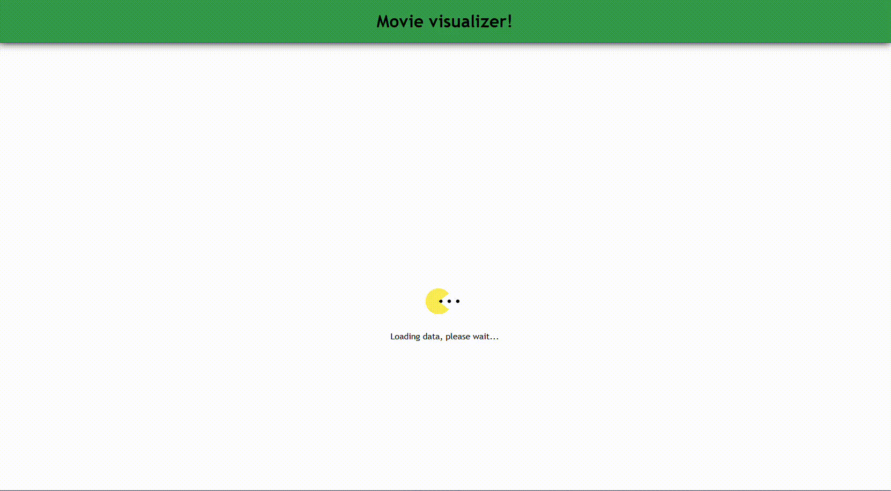
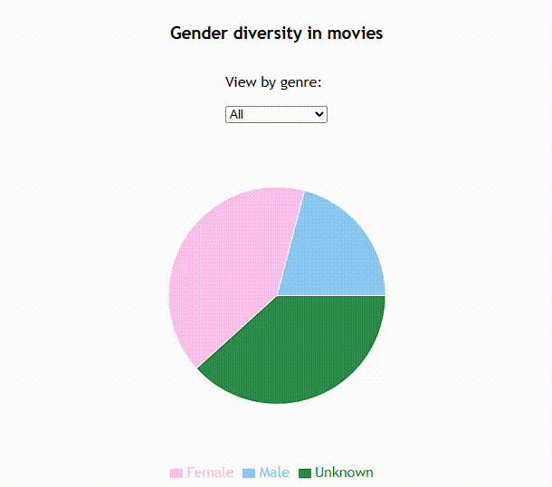
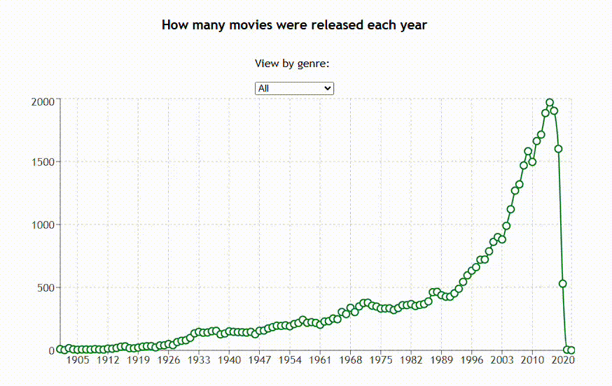

# Project Title

Movie visualizer!

## Project Description

This web application visualizes trends in the film industry with two interactive charts. The first chart shows gender diversity in movies, which can be filtered by genre, allowing users to explore how representation varies across different types of movies. The second chart displays the number of movie releases per year, also filterable by genre, highlighting trends in film production over time. I decided to use a pretty extensive dataset with movie and actor information because the backend was also used for an API assignment beforehand, I have made updates since then for this application by making it more efficient and including more in the nested queries/mutations. This application provides insights into questions like: How has gender diversity evolved? How has movie output changed across genres?
I think it illustrates the answers to the questions well enough, there is a lot of missing data in the dataset concerning gender which makes the "unkown" category extensive unfortunately.

The dataset I have used can be found [HERE](https://www.kaggle.com/datasets/rounakbanik/the-movies-dataset)

## Core Technologies

The technologies used in this project are:

### Frontend:
- Typescript
- [React](https://react.dev/)
- [recharts](https://recharts.org/en-US)
- [lodash](https://lodash.com/)
- [@apollo/client](https://www.apollographql.com/docs/react)
- Netlify

On the frontend I wanted to try something new for me, so I decided to used **Typescript** and **React** as the main development language and library. For the visualization of the charts I went with the **recharts** package to help with the chart components, this made it much easier to build interactive and visually pleasing charts. For data processing I mostly didn't need to use any packages but used **lodash** for a few calculations that where made on the frontend to easier group values that were connected. **@apollo/client** was used to connect to the backend and make it possible to query it.
For deployment platform I went with netflify.

### Backend:
- Javascript
- [Node.js](https://nodejs.org/en)
- [Express](https://expressjs.com/)
- [GraphQL](https://graphql.org/)
- [MySQL](https://www.mysql.com/)
- Heroku

On the backend I used a previous assignment that was to build a **graphQL** API. I went with the language and framework I already know, so it ended up being **JavaScript/node.js** and **express** to build a backend server, this made it easier to learn **graphQL** since it was a new form of API for me that I had never made or used before. As the database I decided to go with an SQL db, more exactly **MySQL** because I think it was the most efficient data storage when dealing with graphQL and saves on db queries.
For deployment platform I went with heroku.

## How to Use

Using the application is easy. It is a single page application so the user only has to enter the site url and wait for the data to load (takes about 30-40seconds because I decided to use a huge dataset and make some of the data processes in the frontend instead of the backend to keep them a bit decoupled and the backend as general as possible to be able to be used by multiple different frontends).

When entering the site you will be greeted by a loading screen like this:

After the data has finished loading (which only happens at site launch). The charts will be visible. The first chart you will see is the gender diversity chart, it has a simple intuitive design so you can easily change the filter by genre like this:

Under that chart you will see the released movies per year chart. It has the same intuitive design as the first chart and also filters by genre, it's easy to navigate like this:

## Link to the Deployed Application

[LINK](https://wt2-movie-visualization.netlify.app/) to the frontend application.

[LINK](https://github.com/JenniferVonT/data-visualization) to the frontend repo.

 

[LINK](https://jen-movie-api-1239f1b4c492.herokuapp.com/graphql) to the backend API.

[LINK](https://github.com/JenniferVonT/MovieAPI) to the backend repo.

 

[LINK](https://www.kaggle.com/datasets/rounakbanik/the-movies-dataset) to the dataset used in the backend.

## Additional features

The application meets the assignment requirements by providing interactive visualizations of gender diversity and movie releases, filterable by genre.

Initial data loading takes 30–40 seconds, but subsequent interactions are fast. The backend API is decoupled from the frontend to allow flexibility and reuse with multiple clients, even if more data processing on the backend could reduce load times I didn't want to make the backend too specific for this frontend. I also went with a very large dataset (over 100 000 datapoints) that goes above and beyond the assigment limit of 1000 datapoint making the load times longer.

Security, accessibility, and proper handling of keys and tokens have been implemented since I keep the sensitive keys on the backend an no keys in the frontend except the public API uri. The source code is well-structured, documented, follows the [LNU coding standards](https://www.npmjs.com/package/@lnu/eslint-config) for javascript, and supports maintainability and code reuse with modules/components.

I did not add any additional requirements.

## Acknowledgements

The sites that I link in the Core Technologies section have helped get started and figuring out the new technologies. Especially the [recharts website](https://recharts.org/en) and the [get started](https://recharts.org/en-US/guide/getting-started) section.
The [graphQL website](https://graphql.org/) and [playground](https://graphql.org/learn/#try-it-out) helped a lot to figure out how a graphQL API is utilized by the end user and what I should think about when creating it.

Other than that it was a bunch of trial-and-error, googling in general to find sources for specific issues I ran into and AI to help understand the new tech and how to utilize them together.